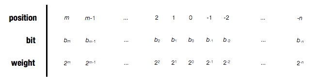

# Introduction

Very large numbers \\(\left(\left|V\right|\gg 0\right)\\) and numbers very
close to zero \\(\left(\left|V\right|\ll 1\right)\\) are represented in the
form \\(V = x \cdot 2^y\\). It's important to note that the representation is
only an approximation; indeed, it would be impossible to precisely represent
the uncountably infinite space of all real numbers with a finite number of
bits.

In 1985, <abbr title='The Institute of Electrical Engineers'>IEEE</abbr>
released a standard for representing _floating-point_ numbers and the details
of the operations performed on them, such as _rounding_, _addition_, and
_multiplication_. In this lesson, we will explore this standard and its various
implications.

# Fractional Numbers

Before we jump in, let's take a look at decimal fractions and binary fractions
in general.

## Decimal

Decimals are usually written as \\(d_m d_{m-1} \ldots d_1 d_0 \.  d_{-1} d_{-2}
\ldots d_{-n}\\), where each \\(d_i\\) is a digit between 0 and 9 inclusive.
The value \\(d\\) is defined as

\\[d = \sum_{i=-n}^m d_i \cdot 10^i\\]

For example, \\(1.28 = (1 \cdot 10^1) + (2 \cdot 10^{-1}) + (8 \cdot 10^{-2})\\).
Notice that digits on the left of the decimal point '.' are
weighted by positive powers of 10, and digits on the right are weighted by
negative powers of 10. This is known as [positional notation][pos].

## Binary

Similarly, we write binary fractions as \\(b_m b_{m-1} \ldots b_1 b_0 \. b_{-1}
b_{-2} \ldots b_{-n}\\), where each \\(b_i\\) is a bit between 0 and 1. The
value \\(b\\) is defined as

\\[b = \sum_{i=-n}^m b_i \cdot 2^i\\]

For example, \\(101.01\_2 = (1 \cdot 2^2) + (0 \cdot 2^1) + (1 \cdot 2^0) + (0
\cdot 2^{-1}) + (1 \cdot 2^{-2})\\). Again, notice that the bits on the left of
the binary point '.' are weighted by positive powers of 2, whereas the digits
on the right are weighted by negative powers of 2. The following diagram
describes this in detail.

Note You might have noticed that fractional
binary notation can only represent numbers that can be written as \\(\sum x
\cdot 2^y\\). Given a fixed number of bits, other numbers are approximated by
rounding. More on this later.

{ "format":   "table",
  "question": "Fill in the missing information in the following table.",
  "headings": ["Fractional value", "Binary representation", "Decimal representation"],
  "grid": [
              ["\\(\frac{1}{8}\\)",    0.001,    0.125   ],
              ["\\(\frac{3}{4}\\)",    "?",      "?"     ],
              ["\\(\frac{25}{16}\\)",  "?",      "?"     ],
              ["?",                     10.1011,  "?"     ],
              ["?",                     1.001,    "?"     ],
              ["?",                     "?",      5.875   ],
              ["?",                     "?",      3.1875  ]
          ],
  "answer": [
              [0,                       0,        0       ],
              [0,                       0.11,     0.75    ],
              [0,                       1.1001,   1.5625  ],
              ["43/16",                 0,        2.6875  ],
              ["9/8",                   0,        1.125   ],
              ["47/8",                  101.111,  0       ],
              ["51/16",                 11.0011,  0       ]
            ]
}

# IEEE 754

When dealing with extremely large or extremely small numbers, people often use
an exponent to reduce the number of written digits. For example, the speed of
light is given as \\(c = 3.0 \times 10^8\, \mathrm{ms^{-1}}\\), and the elementary
charge is written as \\(e = 1.6 \times 10^{-19}\, \mathrm{C}\\). With binary
representations, an exponent may be used similarly to increase the _range_ of
numbers that may be represented by a fixed number of bits.

The IEEE floating-point standard represents a number as follows:

\\[V = (-1)^s \times M \times 2^E\\]

- The _sign_ \\(s\\) is 0 if \\(V\\) is positive, and 1 if \\(V\\) is negative.
- The _significand_ \\(M\\) is a fractional binary number, as discussed in the
  previous section, such that \\(1 \le M \lt 2\\) or \\(0 \le M \lt 1\\).
- The _exponent_ \\(E\\) weighs the value by a power of 2.

Given a fixed number of bits to represent the value \\(V\\), we split the bits
into three fields:

- the first field is a single bit `s` which directly encodes \\(s\\)
- the second is a \\(k\\)-bit field `exp` that encodes \\(E\\)
- the third is a \\(n\\)-bit field `frac` that encodes \\(M\\)

Note the value of \\(M\\) depends on both `frac` and `exp`. More
details later.

The two most common formats are:

          |single-precision | double-precision
----------|-----------------|-----------------
data type |`float`          | `double`
\\(k\\)   |8                | 11
\\(n\\)   |23               | 52
size      |32 bits          | 64 bits

Given a sequence of 32 bits (or 64 bits for double precision), there are three
different cases for interpreting the encoded value depending on the value of
`exp`. Each case is explained in detail below.

## Case 1: Normalized Values

This case occurs if `exp` is neither all 0s nor all 1s. To determine the value
of \\(E\\):

1. Convert `exp` to an integer in base 10. For single precision, this should
   give you a value between 1 and 254.
1. Deduct \\(2^{k-1}\\) from the above result. For single precision, this
   should give you a value between -126 and 127.

Written as a formula, this is equivalent to using \\(E = \mathtt{exp} - 2^{k-1}\\).

To determine the value of \\(M\\), prepend `frac` with `1.`. Then, use the
binary fraction notation (as decribed above) to interpret the value. Written as
a formula, this is equivalent to using \\(M = \mathtt{frac} + 1\\).

#### Example

Suppose we are given the following bits: `0100 0001 1100 1000 0000 0000 0000
0000`

First, we break it up into three fields:

    bits        = 0100 0001 1100 1000 0000 0000 0000 0000
    s           = 0
    exp         =  100 0001 1
    frac        =            100 1000 0000 0000 0000 0000

Then, we interpret each field separately:

    s                            ~> positive

    E     = 1000 0011₂ - 127₁₀   = 131 - 127
                                 = 4₁₀

    M     = 1.1001₂              = 1 + 0.5 + 0.0625
                                 = 1.5625₁₀

Therefore, \\(V = 1.5625 \times 2^4 = 25\\).

{ "format":   "short",
  "question": "What is the decimal representation of `0100 0001 1001 1000 0000 0000 0000 0000`?",
  "answer":   19
}

#### Example

Suppose we have the number \\(1280\\). First, we write down its binary
representation:

    1280₁₀ = 101 0000 0000₂

Next, we _normalize_ it using an exponent, such that it begins with `1.`.

    1280₂ = 1.01₂ x 2¹⁰

    s     ~> positive
    E     = 10₁₀
    M     = 1.01₂

Finally, we determine the values for `exp` and `frac`.

    s                         = 0

    exp   = 127₁₀ + 10₁₀
          = 137₁₀             = 1000 1001₂

    frac  = 1.01₂ - 1₂
          = .01₂              = 010 0000 0000 0000 0000 0000₂

Therefore, the binary representation is `0100 0100 1010 0000 0000 0000 0000 0000`.

{ "format":   "short",
  "question": "What is the binary representation of \\(68\\) in single-precision format? Give the bit sequence without spaces.",
  "answer":   "01000010100010000000000000000000"
}

## Case 2: Denormalized Values

This occurs when the exponent field is all 0s. The value of \\(E\\) is fixed at
\\(1 - 2^{k-1}\\). To determine the value of \\(M\\), prepend `frac` with `0.`.

For example, the bit representation of 0.0 is simply a sequence of zeros.

    0.0         = 0000 0000 0000 0000 0000 0000 0000 0000

Denormalized values allow for [gradual underflow][underflow], which gives more
precision to values that are closer to zero.

#### Example

Suppose we are given the following bits: `0000 0000 0100 0000 0000 0000 0000
0000`

First, we break it up into three fields:

    bits    = 0000 0000 0100 0000 0000 0000 0000 0000
    s       = 0
    exp     =  000 0000 0
    frac    =            100 0000 0000 0000 0000 0000

Then, we interpret each field separately:

    s                   ~> positive
    E   = 1₁₀ - 127₁₀   = -126₁₀
    M   = 0.1₂          = 0.5₁₀

Therefore, \\(V = 0.5 \times 2^{-126} = 2^{-127}\\).

{ "format":   "table",
  "question": "Given the following bit sequences, determine the values of \\(s\\), \\(E\\) and \\(M\\).",
  "headings": ["Bits", "\\(s\\)", "\\(E\\)", "\\(M\\)"],
  "grid":   [
              ["`0000 0000 0100 0000 0000 0000 0000 0000`", "?", "?", "?"],
              ["`1000 0000 0110 0000 0000 0000 0000 0000`", "?", "?", "?"],
              ["`0000 0000 0000 0000 0000 0000 0000 0000`", "?", "?", "?"],
              ["`1000 0000 0000 0000 0000 0000 0000 0000`", "?", "?", "?"]
            ],
  "answer": [
              [0,                                         0,   -126, 0.5  ],
              [0,                                         1,   -126, 0.75 ],
              [0,                                         0,   -126, 0    ],
              [0,                                         1,   -126, 0    ]
            ]
}

## Case 3: Special Values

This occurs when the exponent field is all 1s.

- If `frac` is all 0s, then \\(V\\) is either \\(+\infty\\)  or \\(-\infty\\),
  depending on `s`.
- Otherwise, \\(V = \mathrm{NaN}\\), which stands for "Not a Number"

{ "format":   "short",
  "question": "What is the value of `1111 1111 1111 0000 0000 0000 0000 0000`?",
  "answer":   "NaN"
}

{ "format":   "short",
  "question": "What is the value of `0111 1111 1111 0000 0000 0000 0000 0000`?",
  "answer":   "NaN"
}

{ "format":   "multi",
  "question": "What is the value of `0111 1111 1000 0000 0000 0000 0000 0000`?",
  "answer":   "B",
  "options": {
    "A": "\\(-\infty\\)",
    "B": "\\(+\infty\\)",
    "C": "NaN"
  }
}

# Rounding

Given a fixed number of bits, the set of numbers that can be represented is
finite (in fact, it is no more than \\(2^{m}\\), where \\(m\\) is the number of
bits). However, the space of all real numbers is uncountably infinite.
Therefore, it's necessary to _round_ some numbers to their nearest
representable value.

The default rounding defined in IEEE 754 is _round-to-even_. Consider a number
\\(x\\) that is between two representable values \\(x^+\\) and \\(x^-\\), such
that \\(x^- \lt x \lt x^+\\).

- If \\(x\\) is nearer to either value, round \\(x\\) to the nearer value
- If \\(x\\) is exactly between \\(x^-\\) and \\(x^+\\), round \\(x\\) to the
  even value.

For whole numbers, this means that both 3.5 and 4.5 are rounded to 4. For
decimals, this rounds 2.35 and 2.45 to 2.4, if we are only allowed 1 decimal
place. Note that 2.46 is still rounded to 2.5, since it's nearer to 2.5 than
to 2.4.

The same applies to binary representations. Suppose we only have 1 bits with a
leading 1. Representable values are: 1.0₂, 1.1₂.

- 1.0011₂ and 1.0010₂ will be rounded down to 1.0₂ because they are
nearer to 1.0₂ than to 1.1₂.
- 1.011₂ will be rounded up to 1.1₂ because it is nearer to 1.1₂ than to
  1.0₂.
- 1.010₂ is 0.010₂ away from both 1.0₂ and from 1.1₂. It's rounded to 1.0₂
  using round-to-even.

{ "format":   "short",
  "question": "Consider a floating-point format that only allows 4 bits for the `frac` field. What value will \\(1.7\\) be rounded to? Give the answer in decimal notation.",
  "answer":   1.6875
}

{ "format":   "short",
  "question": "Consider a floating-point format that only allows 4 bits for the `frac` field. What value will \\(1.71875\\) be rounded to? Give the answer in decimal notation.",
  "answer":   1.6875
}

If you would like to have more practice, use this [online binary-decimal
converter][converter] and generate your own examples.

  [pos]:        http://en.wikipedia.org/wiki/Positional_notation
  [converter]:  http://www.binaryconvert.com/
  [underflow]:  http://www.cs.rice.edu/~taha/teaching/05F/210/Labs/Lab07/gradualUnderflow.html
